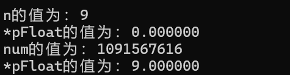
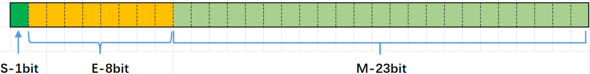
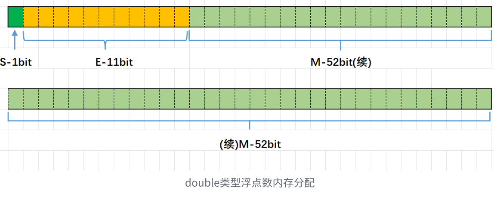
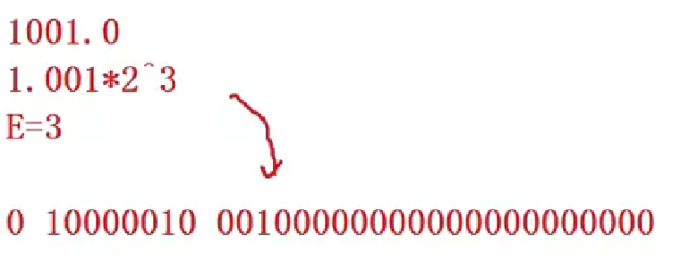

## 浮点数的存储
- 先分析一下代码：
```
#include <stdio.h>
int main()
{
    int n = 9;
    float *pFloat = (float *)&n;
    printf("n的值为：%d\n",n);
    printf("*pFloat的值为：%f\n",*pFloat);
    *pFloat = 9.0;
    printf("num的值为：%d\n",n);
    printf("*pFloat的值为：%f\n",*pFloat);
    return 0;
}
```
- 运行结果：

- 为啥会出现这样的情况呢：
    1. 首先，9是以整形的方式存进去的，但以浮点型的方式取出--失败
    2. 把9.0以浮点数的方式存进去，以整形的方式取出--失败
    3. 所以，说明这两种数据形式的存储方式是不同的
- 我们拿"5.5f"来看：
    1. 二进制：101.1----》1.011*2^2---->(-1)^0*1.011*2^2
    2. s=0; M=1.011(对于M,因为整数部分一定为1.所以只需要存小数点后面的位数)；E=2(无符号整数);




- 上面的图是float型的，可见，float只保存了小数点后23位
- 如果E为8位，它的取值范围为0~255；如果E为11位，它的取值范围为0~2047。但是，我们知道，科学计数法中的E是可以出现负数的，所以IEEE754规定，存⼊内存时E的真实值必须再加上⼀个中间数，对于8位的E，这个中间数是127；对于11位的E，这个中间数是1023。⽐如，2^10的E是10，所以保存成32位浮点数时，必须保存成10+127=137，即10001001。


### 上面讲的是存进去，那取出来又是怎么弄的呢？
- E不全为0或不全为1
    - 这时，浮点数就采⽤下⾯的规则表⽰，即指数E的计算值减去127（或1023），得到真实值，再将有效数字M前加上第⼀位的1
- E全为0
    - 说明啥了，这个数太小了，之前都给它加了127了还为0，说明这个数是无限接近为0；
- E全为1：正负无穷大


