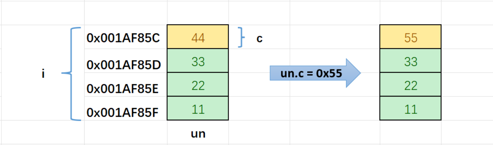

## 联合(共用体)
- 联合的成员是共⽤同⼀块内存空间的，这样⼀个联合变量的⼤⼩，⾄少是最⼤成员的⼤⼩（因为联合⾄少得有能⼒保存最⼤的那个成员）。
- 由于共用一块内存，修改一个变量就会改变其它变量，所以同一时间只能用一个变量
```
#include <stdio.h>
//联合类型的声明 
union Un
{
    char c;
    int i;
};
int main()
{
    //联合变量的定义 
    union Un un = {0};
    un.i = 0x11223344;
    un.c = 0x55;
    printf("%x\n", un.i);
    return 0;
}
```
- 输出：11223355(由此可见：判断大小端)


## 联合体的大小计算

- 联合的⼤⼩⾄少是最⼤成员的⼤⼩。
- 当最⼤成员⼤⼩不是最⼤对⻬数的整数倍的时候，就要对⻬到最⼤对⻬数的整数倍。
```
#include <stdio.h>
union u
{
	int t;
	char arr[5];
};
int main()
{
	printf("%d", sizeof(union u));
	return 0;
}
程序结果：8
分析：
1.首先要知道最大对齐数：t:4;arr:1(char类型)；所以是4
2.知道最大成员：arr: 1*5=5
3.所以5<4*2,大小为8
```